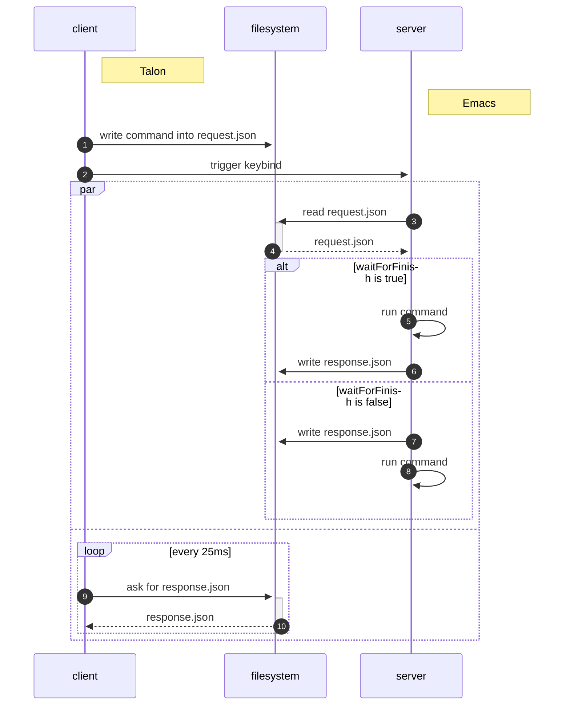

# emacs-command-server
A minimal file based RPC server for Emacs. The typical client for usage is Talon.

## Workflow

See `example-client.sh` for an example of using the shell as a client.

### Caveats
 - global!
;; TODO: globalized minor mode that is always all or nothing?

 - isearch

### Unknowns
- Does it work on Windows?
